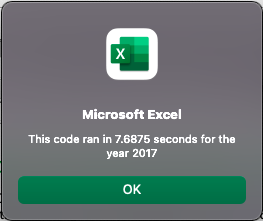

# Stock Analysis - VBA Challenge

## Project Overview

The purpose of this project is to analyze the performance of green energy stocks in 2017 and 2018 to advise investors. The specific values found were total daily volume over the year and yearly return. The analysis is all done within Microsoft Excel using Virtual Basic for Applications (VBA).

The challenge portion of this module involved refactoring an existing analysis macro to be able to run faster and on a larger number of stocks at once.

## Results

    

These images show the script's resulting data (outcome was the same both for the original macro and the refactored macro).

The key difference in the code of the original macro versus the refactored one is that the original performs all tasks one row at a time, assigning values to simple variables and populating one row of the output sheet at a time with the values. Below are the variables that stored the values in the original macro.

    totalVolume = 0      
    Dim startingPrice As Double
    Dim endingPrice As Double

The refactored macro establishes the variables as arrays instead, and loops through all of the data at once, populating the sheet with the information in all of the arrays after the loop has fully run. Below are the variables that stored the values in the refactored macro.

    Dim tickerVolumes(12) As Long
    Dim tickerStartingPrices(12) As Single
    Dim tickerEndingPrices(12) As Single
    
The stock data in the workbook includes opening price, closing price, high, low, and volume for each day of the year. The values of total daily volume and yearly return were gathered using a similar series of conditional statements in both the original and refactored macros. Below is an example of the conditional statement used to get the total daily volume of a given ticker.

    If Cells(i, 1).Value = tickers(tickerIndex) Then
        tickerVolumes(tickerIndex) = tickerVolumes(tickerIndex) + Cells(i, 8).Value
    End If
    
Statements following the same pattern were used to get the starting price and ending price values. Below is the for loop that was used to populate the worksheet with the results in the refactored macro.

    For i = 0 To 11
        
        Worksheets("All Stocks Analysis").Activate
        Cells(4 + i, 1).Value = tickers(i)
        Cells(4 + i, 2).Value = tickerVolumes(i)
        Cells(4 + i, 3).Value = tickerEndingPrices(i) / tickerStartingPrices(i) - 1
        
        
    Next i

An unexpected result of this refactoring is that the refactored macro ran more slowly than the original. This was the opposite of the intended result, and at this point I am not sure why this happened. A deeper dive will need to be done to look into this further. Below are the run times of the macro for 2017 (top) and 2018 (bottom), with the original macro's results on the left and the refactored macro's results on the right.

   

   

## Summary

An advantage of refactoring code is to provide a more "elegant" solution to a problem, now that it has been solved. It allows you to explore the other possibilities of your code to both refine your existing code and explore new lines of thought to approach the same problem. Refactoring can also result in a faster, more readable, and/or more easily copied version of your code.

A possible disadvantage of refactoring is spending extra time on a piece of code that may be efficient and effective as is. Also, in this case, the refactored code ran more slowly than the original. This may be due to some inconsistency or mistake in the original or refactored code, but at this time the refactored code is not necessarily an improvement on the original. Again, more work into this is necesary to understand this difference. 

All in all, this challenged has provided me with good practice in refactoring and helped me to see the benefits of it. Self-correcting is an important part of any creative and problem-solving work, and building these skills now will help in future projects.
